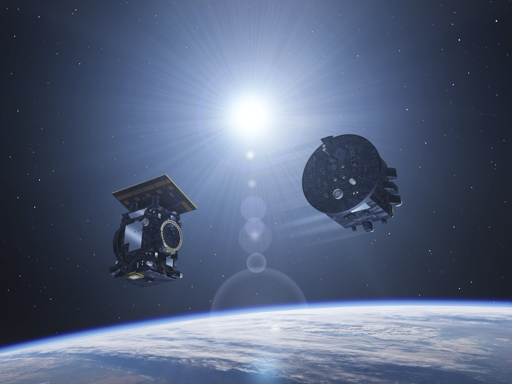

## Proba-3, un duo de satellites s’envole pour éclipser le Soleil

Publié le Mardi 3 Décembre 2024

Vue d’artiste représentant les deux satellites de la mission Proba-3 de l’ESA

#### L’Agence spatiale européenne va lancer, le 4 décembre, en Inde, une « mission de démonstration » de deux engins spatiaux pour révéler l’atmosphère solaire, que les scientifiques nomment la « couronne proche ».

##### C’est une mission spatiale un peu spéciale qui doit quitter la Terre, mercredi 4 décembre. L’Agence spatiale européenne (ESA), qui la lance, définit, en effet, Proba-3 comme une « mission de démonstration ». 

##### « Avec une mission de démonstration, répond Damien Galano, chef du projet à l’ESA, on veut montrer ce qu’une technologie spécifique est capable de réaliser en orbite, dans les conditions spatiales. On veut prouver que ça fonctionne. » Le nom de « Proba » n’est donc pas à rapprocher du diminutif de « probabilité » qu’utilisent les mathématiciens mais plutôt du proba latin, qui signifie « épreuve ».  

